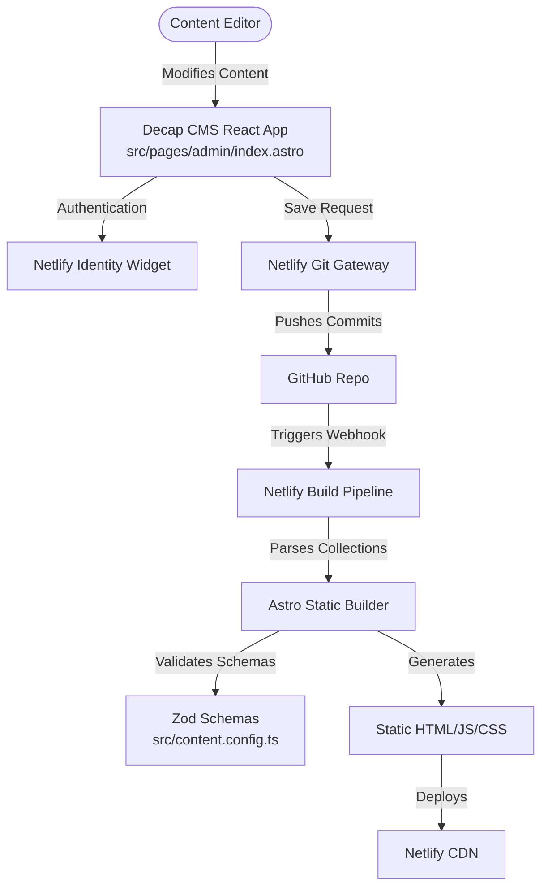

# Spec: Astro Bistro Decap CMS Template Refactor

This specification outlines the architecture, design choices, and implementation record for turning the Astro Bistro template into a reusable, git-based CMS-managed website.

> **Status: ✅ Complete** — All phases have been merged into `feat/generic-collections` (PR #2).

---

## 1. Architectural Model

### Core Components:
1. **CMS Dashboard (`src/pages/admin/index.astro`)**: An Astro-compiled admin panel powered by Decap CMS UMD, with custom styled preview templates for every collection. Building as a static page means zero Netlify serverless compute is consumed.
2. **Netlify Identity & Git Gateway**: Manages access control (inviting admins, logins) and securely handles writing edits directly to Git. Registration must be set to **Invite Only** to protect write access.
3. **Astro Content Collections (`src/content/`)**: Astro's type-safe system for reading local Markdown files, validating frontmatter structures with Zod, and building high-performance static HTML pages.

---

## 2. Core Template Design Decisions

### A. Graceful UI Fallbacks (No Crashes on Empty State)
* **Collections Check**: For every folder-based collection (features, testimonials, blog), components check if `collection.length === 0`.
* **Behavior**:
  * If a list is empty in production, the corresponding UI section gracefully hides.
  * In local development mode (`import.meta.env.DEV`), a helpful developer notice is rendered: *"No items found. Go to /admin to add some!"*

### B. Media and Assets
* All images uploaded via the CMS dashboard go to `public/images/uploads/`.
* The CMS references them as `/images/uploads/filename.ext`.

### C. Dynamic Icon Loading
* An icon registry file at `src/utils/icons.ts` maps string keys (e.g. `"ChefHat"`, `"Mail"`) to React Lucide components.
* This avoids importing the entire `lucide-react` library into the final bundle.

### D. Decap CMS Admin (Astro Route)
* The CMS entry point lives at `src/pages/admin/index.astro` (not `public/admin/index.html`).
* This allows Astro/Vite to compile and inject Tailwind CSS, which is then synced into the Decap preview iframe via a `syncIframeStyles` helper.
* Custom preview templates are registered per collection/file using `CMS.registerPreviewTemplate()`.

---

## 3. Content Collections

| Collection | Type | Folder | Section |
|---|---|---|---|
| `sections` | Files | `src/content/sections/` | Hero, About, Contact, Promotions |
| `features` | Folder | `src/content/features/` | Popular Dishes |
| `testimonials` | Folder | `src/content/testimonials/` | Testimonials |
| `blog` | Folder | `src/content/blog/` | New Items / Blog |

### Sections Files (`src/content/sections/`)

| File | Key Fields |
|---|---|
| `hero.md` | `title`, `description`, `slides[]` (id, img, imgAlt, userComment, userAvatar) |
| `about.md` | `badge`, `title`, `description`, `readMoreLink`, `image`, `stats[]` |
| `contact.md` | `badge`, `title`, `description`, `image`, `rightTitle`, `rightDescription`, `contact[]` |
| `promotions.md` | `promotions[]` (src, alt, className, offerText, offerButton) |

---

## 4. Verification & Testing Strategy

1. **TypeScript Checks**: `pnpm run check-types` must exit successfully.
2. **Build Integrity**: `pnpm run build` must produce a clean `dist/` output.
3. **Empty States**: Removing all files from a folder collection hides the section in production and shows a dev notice in development.
4. **CMS Previews**: Open `http://localhost:4321/admin/`, select any collection entry, and verify the right-hand preview renders with correct Tailwind styles, fonts, and icons matching the live site.
