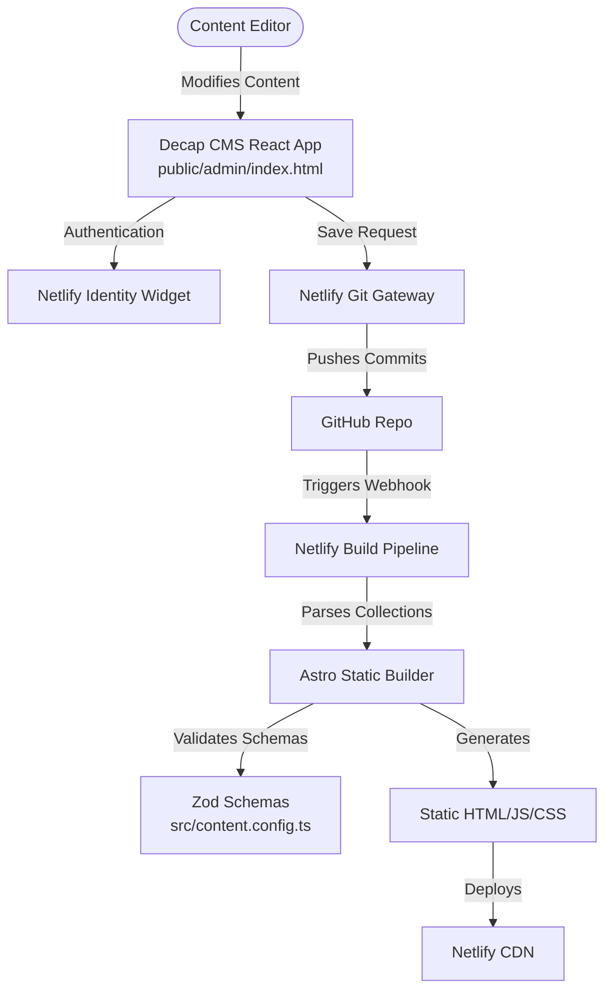

# Spec: Astro Bistro Decap CMS Template Refactor

This specification outlines the architecture, design choices, and phase-by-phase execution plan to turn the Astro Bistro template into a reusable, git-based CMS-managed website. 

---

## 1. Architectural Model

### Core Components:
1. **CMS Dashboard (`public/admin/`)**: A client-side, zero-database administration panel powered by Decap CMS.
2. **Netlify Identity & Git Gateway**: Manages access control (inviting admins, logins) and securely handles writing edits directly to Git without exposing repository keys.
3. **Astro Content Collections (`src/content/`)**: Astro's type-safe system for reading local Markdown/JSON files, validating frontmatter structures with Zod, and building high-performance static HTML pages.

---

## 2. Core Template Design Decisions

To make this repository a bulletproof **reusable template** that others can adopt, we will follow these principles:

### A. Graceful UI Fallbacks (No Crashes on Empty State)
When a user boots up this template for their own business, they may want to delete all our mock products and reviews. The website must not crash.
* **Collections Check**: For every folder-based collection (Products, Testimonials, Slides), components will check if `collection.length === 0`.
* **Behavior**: 
  * If a list is empty in production, the corresponding UI section will **gracefully hide** or collapse so the website looks complete.
  * In local development mode (`import.meta.env.DEV`), we will render a helpful developer notice: *"No items found. Go to /admin to add some!"*

### B. Media and Assets
* All images uploaded via the CMS dashboard will go to `public/images/uploads/`.
* The CMS will reference them as `/images/uploads/filename.ext`, allowing Astro's static server and build pipeline to resolve them correctly.

### C. Dynamic Icon Loading
Decap CMS stores icons as simple strings (e.g. `"ChefHat"`, `"Mail"`).
* We will establish an icon registry file (`src/utils/icons.ts`) mapping string keys to React Lucide components.
* This avoids importing the entire `lucide-react` library into the final bundle, keeping load times fast (critical for SEO).

---

## 3. Step-by-Step Phased Execution (PR Blueprint)

We will execute this refactor across four isolated branches/PRs to discuss, code, and test each section incrementally.

### Phase 1 (PR #1): CMS Infrastructure & Netlify Auth Setup
* **Branch**: `feat/cms-infrastructure`
* **Goal**: Establish the admin panel and auth wiring.
* **Files Affected**:
  * Create `netlify.toml` with build settings.
  * Create `public/admin/index.html` (admin shell).
  * Create `public/admin/config.yml` (CMS generic collection layouts: `slides`, `products`, `testimonials`, `articles`, `pages/home`).
  * Modify `src/layouts/Layout.astro` to embed the Netlify Identity widget and redirect scripts.
* **Verification**: Verify `/admin/index.html` displays the login widget locally and compiling the project runs successfully.

### Phase 2 (PR #2): Slides & Products Collections
* **Branch**: `feat/slides-products-collections`
* **Goal**: Refactor the Hero slider and Products grid.
* **Files Affected**:
  * Modify `src/content.config.ts` to define Zod schemas for `slides` and `products`.
  * Create markdown entries under `src/content/slides/` and `src/content/products/` matching the current template content.
  * Modify `src/pages/index.astro` to load these collections dynamically.
  * Refactor components (`HeroSection`, `PopularDishes`) to handle empty lists safely.
* **Verification**: Ensure Hero and Products sections look identical to the baseline, and hide correctly if markdown files are removed.

### Phase 3 (PR #3): About Section, Testimonials & Articles
* **Branch**: `feat/about-testimonials-articles`
* **Goal**: Refactor sections with icons (About section achievements stats), customer reviews, and article cards.
* **Files Affected**:
  * Create `src/utils/icons.ts` for Lucide React dynamic lookup mapping.
  * Modify `src/content.config.ts` for testimonials, articles, and about schemas.
  * Create markdown files for testimonies, stats, and articles.
  * Refactor `AboutUs`, `Testimonials`, and `NewItems` components to use generic schemas and data sources.
* **Verification**: Verify icon mapping works correctly and reviewers ratings are type-safe.

### Phase 4 (PR #4): Contact coordinates, Promotions Banners & Production Build
* **Branch**: `feat/contact-promotions-cleanup`
* **Goal**: Migrate remaining layout details (hours, phone, address cards, promotions grid graphics) and perform final verification.
* **Files Affected**:
  * Define schemas for contact data and promotions layout.
  * Build final markdown pages.
  * Modify components (`ContactUs`, `Offers`) to load dynamic coordinates and promotions data.
* **Verification**: Run `npm run check-types` and `npm run build` to verify there are no compilation errors.

---

## 4. Verification & Testing Strategy

To ensure zero regression:
1. **TypeScript Checks**: `npm run check-types` must exit successfully on every branch before PR approval.
2. **Build Integrity**: `npm run build` must run successfully on each step, ensuring Astro builds correct HTML/CSS bundles.
3. **Empty States**: Test deleting all content files from a collection to verify that the template hides empty components cleanly without throwing runtime crashes.
